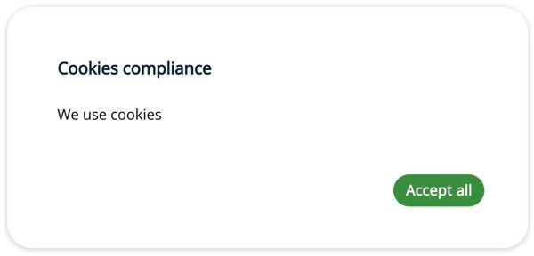
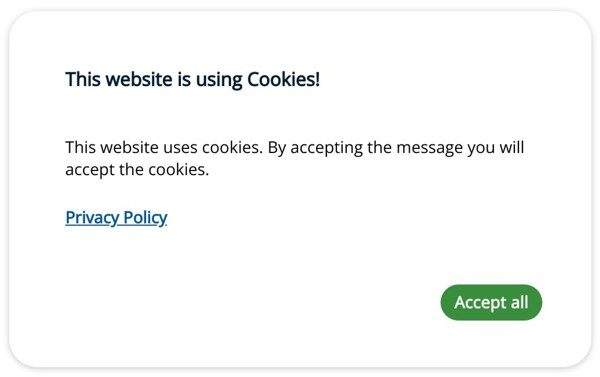
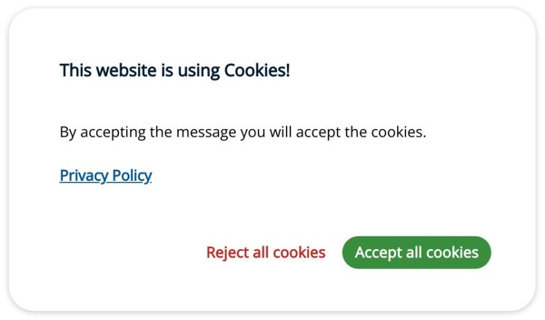
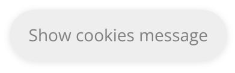
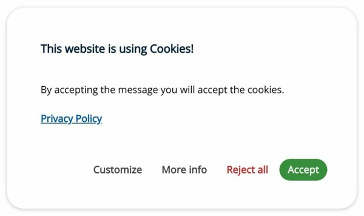

# Cookies Consent JS

## Basic usage

Place the stylesheet links into the head before all other stylesheets to load the CSS.

```HTML
<link href="cookiesconsent.min.css" rel="stylesheet">
```

Place the script near the end of your pages, right before the closing body tag.

```HTML
<script src="cookiesconsent.min.js"></script>
```

### Call the function after your scripts and set the parameters.

```HTML
<script> const cc = CookiesConsentJS({ parameters }); </script>
```



### Adding a title, a personal message, a policy link and the cookies validity time.

```HTML
const message_body = "<p>This website uses cookies. By accepting the message you will accept the cookies.</p>";

const cc = CookiesConsentJS({
    expirationDays: 365,
    content: {
        title: "This website is using Cookies!",
        message: message_body,
        policy: "Privacy Policy",
        policyLink: "https://gdpr-info.eu/"
    }
});
```



### Adding and customizing some basic buttons.

```HTML
const cc = CookiesConsentJS({
    expirationDays: 365,
    buttons: ["reject", "accept", "dismiss"],
    content: {
        title: "This website is using Cookies!",
        message: "<p>By accepting the message you will accept the cookies.</p>",
        policy: "Privacy Policy",
        policyLink: "https://gdpr-info.eu/",
        btnAccept: "Accept all cookies",
        btnReject: "Reject all cookies",
        btnDismiss: "Show cookies message"
    }
});
```



As we specified that we want the dismiss button, after accepting or rejecting the cookies consent, this button will be displayed on the page.



### Adding all buttons.

```HTML
const cc = CookiesConsentJS({
    expirationDays: 365,
    buttons: ["settings", "info", "reject", "accept", "dismiss"],
    content: {
        title: "This website is using Cookies!",
        message: "<p>By accepting the message you will accept the cookies.</p>",
        policy: "Privacy Policy",
        policyLink: "https://gdpr-info.eu/",
        btnAccept: "Accept",
        btnReject: "Reject all",
        btnDismiss: "Show cookies message",
        btnSettings: "Customize",
        btnInfo: "More info"
    }
});
```

After adding settings and info buttons it is necessary to configure their own sections.

