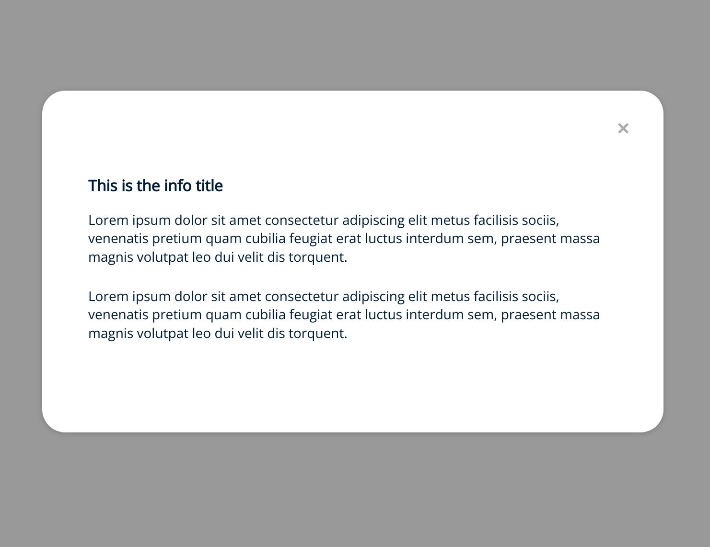

# Cookies Consent JS

## Configuring the information window

To access to the information window we must add an info type button and define the content of the window.

The content of the information window may be a text or HTML code.

```HTML
const info_content = `<h2>This is the info title</h2><p>Lorem ipsum dolor sit amet consectetur adipiscing elit metus facilisis sociis, venenatis pretium quam cubilia feugiat erat luctus interdum sem, praesent massa magnis volutpat leo dui velit dis torquent.</p><p>Lorem ipsum dolor sit amet consectetur adipiscing elit metus facilisis sociis, venenatis pretium quam cubilia feugiat erat luctus interdum sem, praesent massa magnis volutpat leo dui velit dis torquent.</p>`;

const cc = CookiesConsentJS({
    expirationDays: 365,
    buttons: ["info", "reject", "accept"],
    content: {
        title: "This website is using Cookies!",
        message: "<p>By accepting the message you will accept the cookies.</p>",
        btnAccept: "Accept",
        btnReject: "Reject all",
        btnInfo: "More info",
        info: info_content
    }
});
```

