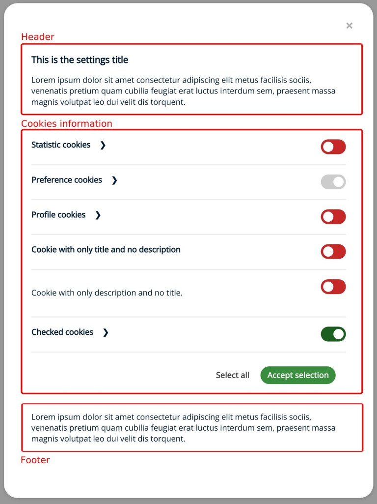
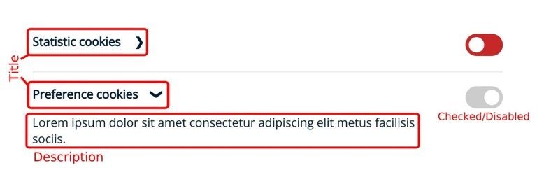

# Cookies Consent JS

## Configuring the settings window

To access the settings window we must add a settings type button and define the content of the window.

The settings windows is composed of three sections: header, cookies information and footer. The header and the footer are optional.

### Defining the content of the header and footer in variables.

```HTML
const header_content = "<h2>This is the settings title</h2><p>Lorem ipsum dolor sit amet consectetur adipiscing elit metus facilisis sociis, venenatis pretium quam cubilia feugiat erat luctus interdum sem, praesent massa magnis volutpat leo dui velit dis torquent.</p>"

const footer_content = "<p>Lorem ipsum dolor sit amet consectetur adipiscing elit metus facilisis sociis, venenatis pretium quam cubilia feugiat erat luctus interdum sem, praesent massa magnis volutpat leo dui velit dis torquent.</p>"
```

### Calling the function.

```HTML
const cc = CookiesConsentJS({
    expirationDays: 365,
    buttons: ["settings", "reject", "accept"],
    content: {
        title: "Title...",
        message: "<p>Message...</p>",
        btnAccept: "Accept",
        btnReject: "Reject all",
        btnSettings: "Settings",
        settingsHeader: header_content,
        settingsFooter: footer_content
    },
    cookies: {
        // Here we will define the cookies
    }
});
```

### Defining cookies.

```HTML
cookies: {
    statistics: {
        name: "stats",
        title: "Statistic cookies",
        description: "<p>Lorem ipsum dolor sit amet consectetur adipiscing elit metus facilisis sociis.</p>",
    },
    preferences: {
        name: "prefs",
        title: "Preference cookies",
        description: "<p>Lorem ipsum dolor sit amet consectetur adipiscing elit metus facilisis sociis.</p>",
        checked: true,
        disabled: true,
    },
    profile: {
        name: "profile",
        title: "Profile cookies",
        description: "<p>Lorem ipsum dolor sit amet consectetur adipiscing elit metus facilisis sociis.</p>",
        disabled: true,
    },
    only_title: {
        name: "only_title",
        title: "Cookie with only title and no description",
        disabled: false,
    },
    only_description: {
        name: "only_description",
        description: "<p>Lorem ipsum dolor sit amet consectetur adipiscing elit metus facilisis sociis.</p>",
        disabled: true,
    },
    cookie_checked: {
        name: "cc-checked",
        title: "Checked cookies",
        description : "<p>Lorem ipsum dolor sit amet consectetur adipiscing elit metus facilisis sociis.</p>",
        checked: true,
        disabled: false,
    },
}
```



