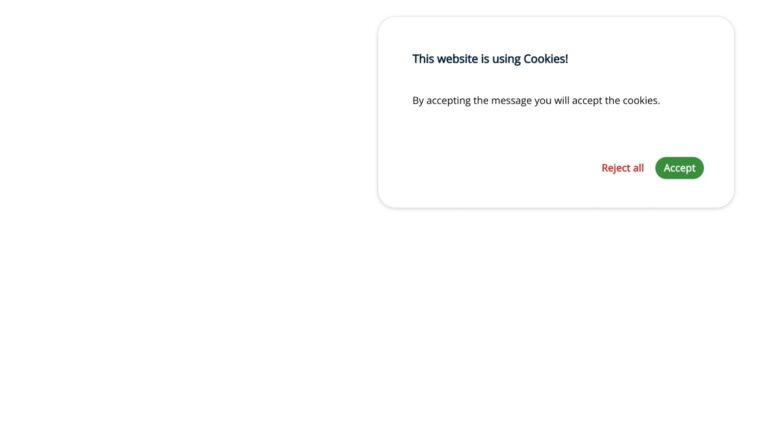

# Cookies Consent JS

## Positioning the window

To specify the position of the window we must set the parameter position with the corresponding location.

On small devices the width will be always 100%.

```HTML
const cc = CookiesConsentJS({
    position: "top-right"
    ...
});
```

### Available positions

**bottom-left** (default)


**bottom-center**


**bottom-right**


**bottom** (full width)


**top-left**


**top-center**


**top-right**



**top** (full width)

