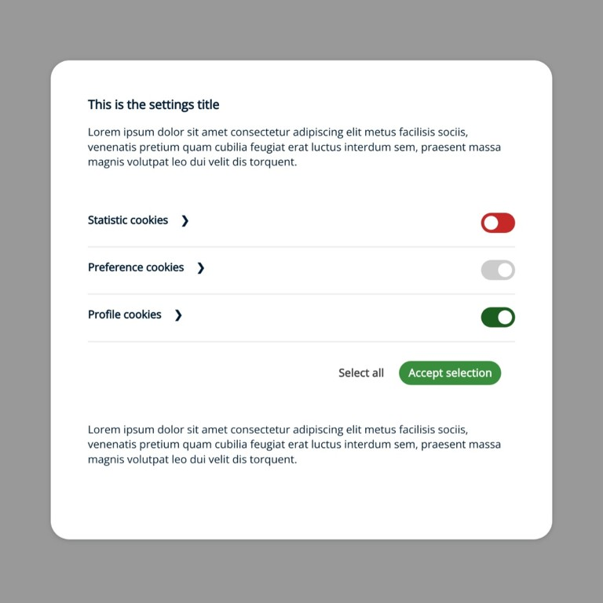

# Cookies Consent JS

## Setting the settings window as the main window

To set the settings window we must set the parameter mainWindowSettings as true. After this configuration, the cookies consent message window will not appear so we do not have to configure it.

```HTML
const cc = CookiesConsentJS({
    mainWindowSettings: true,
    ...
});
```

In this case the settings window will not have a button to close it. It will be closed after the user’s choice.

