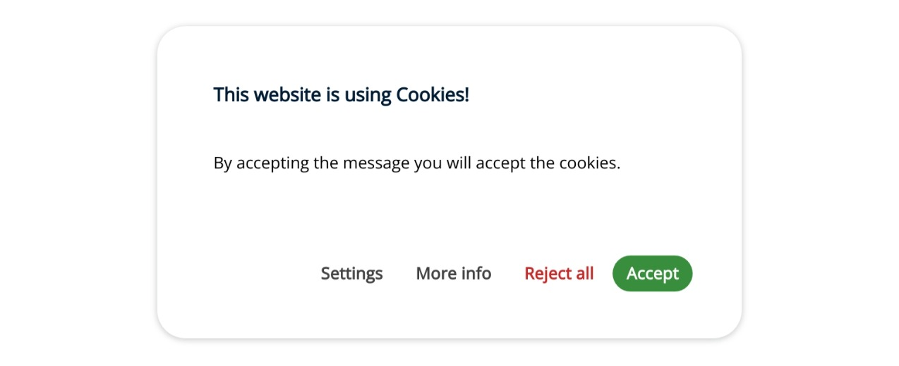
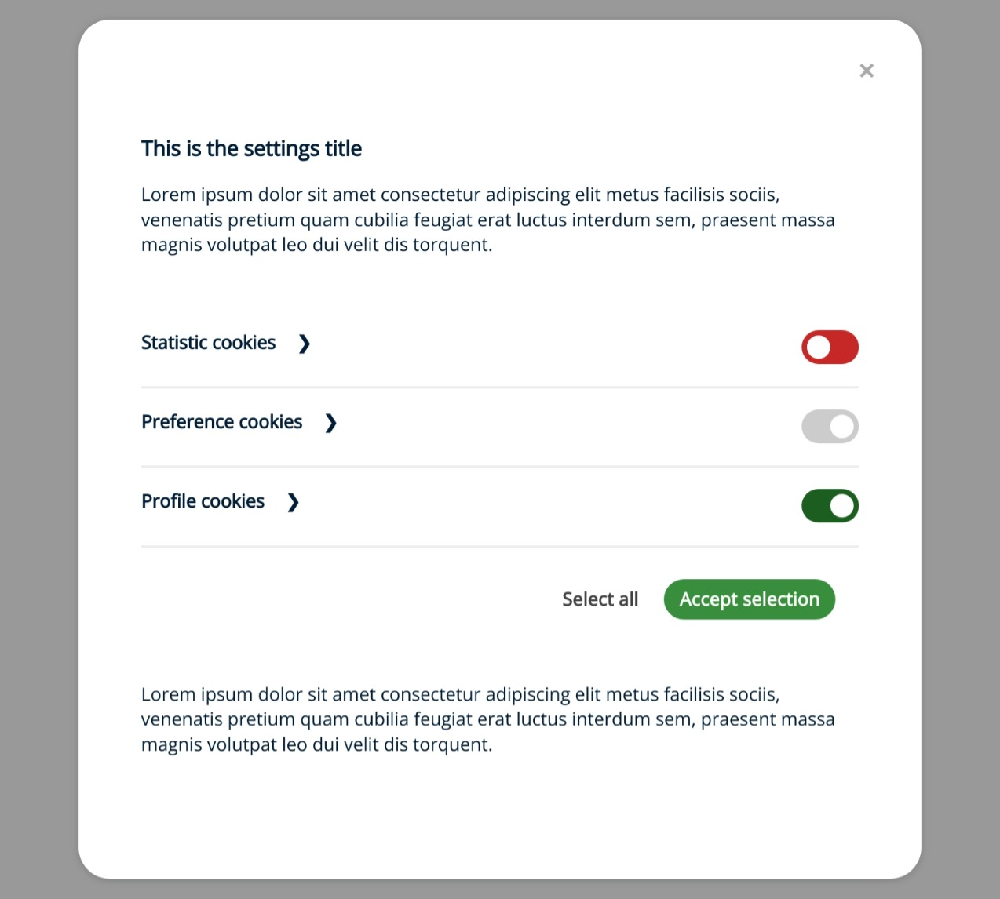
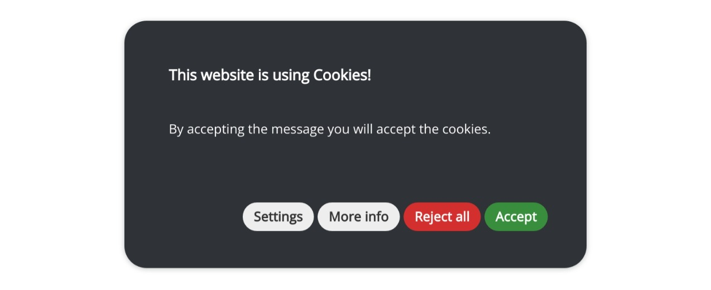
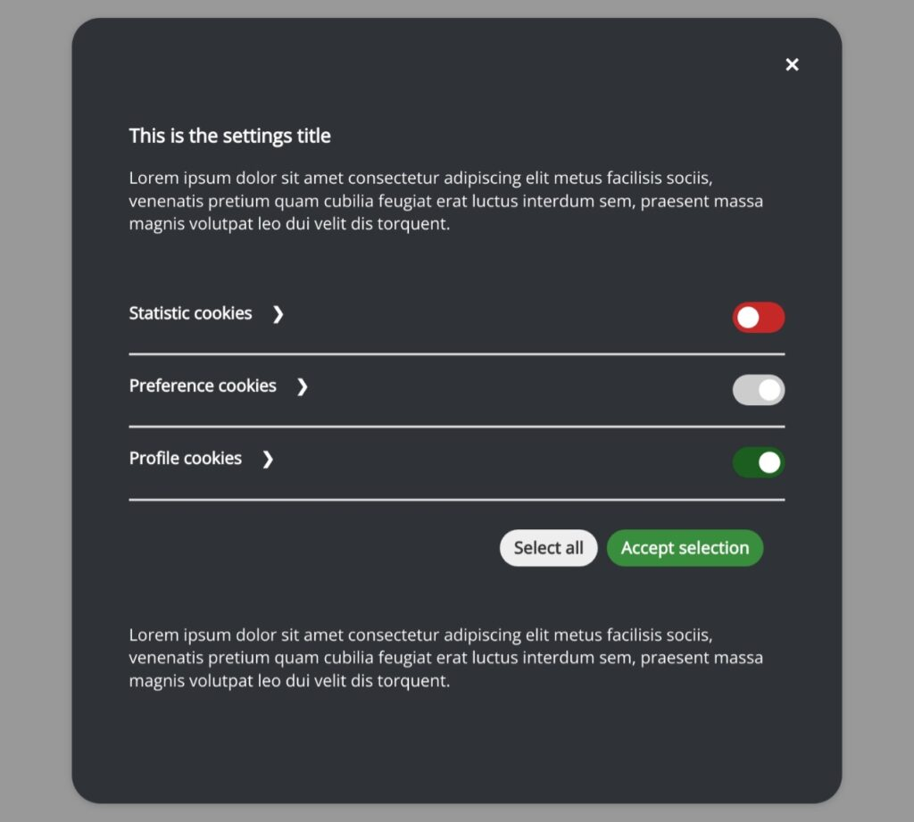
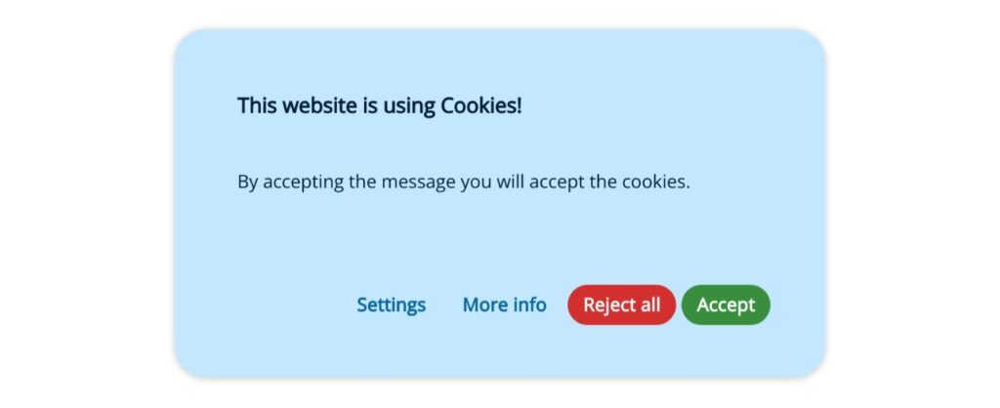
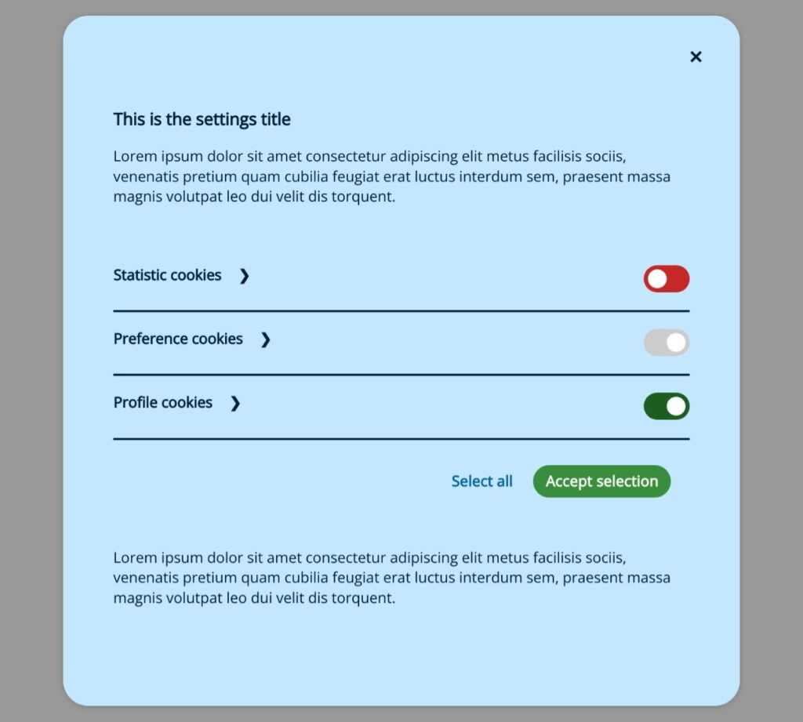
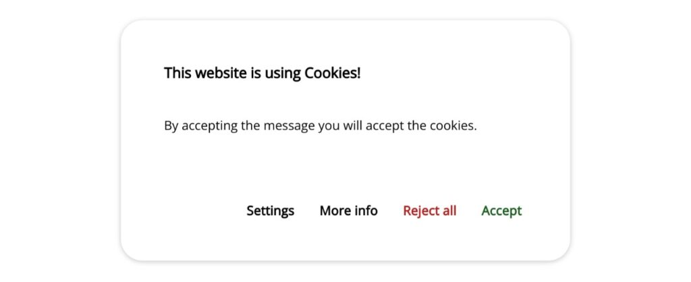
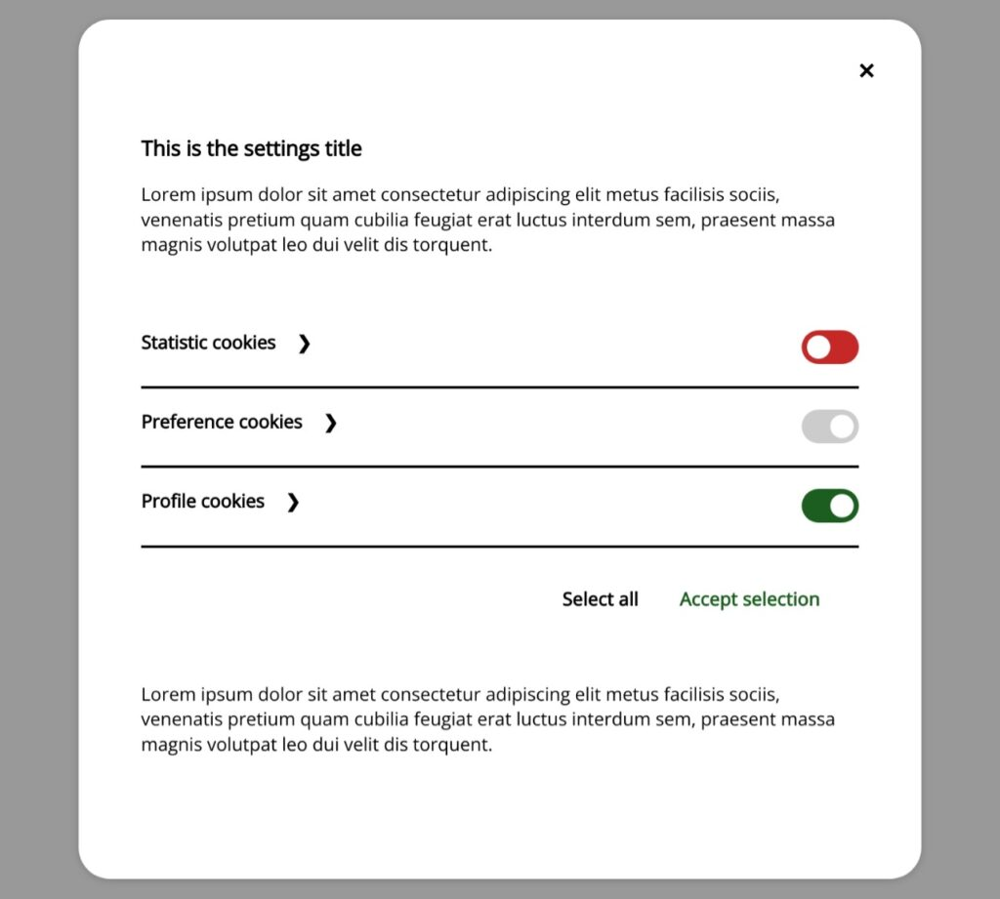

# Cookies Consent JS

## Themes

There are 4 different themes that we can use to change the appearance of our cookies consent window or easily create our own.

To use a theme, we must reference its style sheet before the general styles.

```HTML
<link href="themes/cookiesconsent.theme-smooth.css" rel="stylesheet">
<link href="cookiesconsent.min.css" rel="stylesheet">
```

If we want to use the default theme we should not reference anything.

### Available themes

**Default** (No reference needed)




**Dark** (cookiesconsent.theme-dark.css)




**Smooth** (cookiesconsent.theme-smooth.css)




**Contrast** (cookiesconsent.theme-contrast.css)


